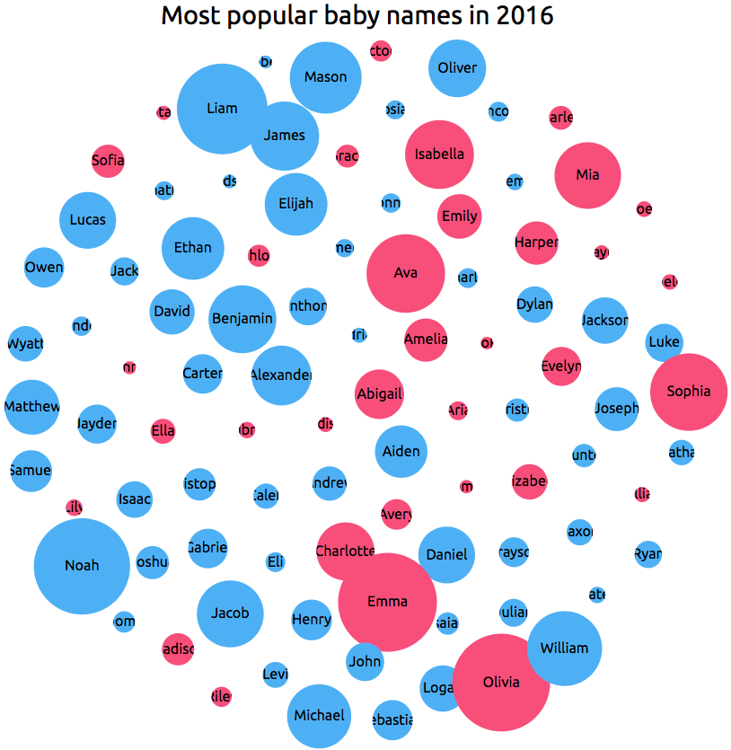

[](https://taylorchasewhite.github.io/babyNames/)]
<a name="bubbleChart"></a>

## bubbleChart
**Kind**: global class  
**Summary**: Generate a reusable bubble chart  
**Requires**: <code>module:d3.v4.js</code>  
**Since**: 07.04.17  
**Author**: Deborah Mesquita  
**Author**: Taylor White <whitetc2@gmail.com>  

* [bubbleChart](#bubbleChart)
    * [new bubbleChart()](#new_bubbleChart_new)
    * [~chart(selection)](#bubbleChart..chart)
    * [~chartWidth([value])](#bubbleChart..chartWidth) ⇒
    * [~chartHeight([value])](#bubbleChart..chartHeight) ⇒
    * [~chartColForColors([value])](#bubbleChart..chartColForColors) ⇒
    * [~chartColForTitle([value])](#bubbleChart..chartColForTitle) ⇒
    * [~chartColForRadius([value])](#bubbleChart..chartColForRadius) ⇒
    * [~chartMinRadius([value])](#bubbleChart..chartMinRadius) ⇒
    * [~chartMaxRadius([value])](#bubbleChart..chartMaxRadius) ⇒
    * [~chartUnitName([value])](#bubbleChart..chartUnitName) ⇒
    * [~chartForceApart([value])](#bubbleChart..chartForceApart) ⇒
    * [~chartShowTitleOnCircle([value])](#bubbleChart..chartShowTitleOnCircle) ⇒
    * [~chartCustomColors(domain, range)](#bubbleChart..chartCustomColors) ⇒
    * [~chartTitle(value)](#bubbleChart..chartTitle) ⇒
    * [~chartRemove([callback])](#bubbleChart..chartRemove) ⇒

<a name="new_bubbleChart_new"></a>

### new bubbleChart()
Purpose:
Generate a reusable bubble chart

Instantiate the settings before rendering the bubble chart
Generate a reusable bubble chart using d3.v4.js on a dataset loaded through D3.

Original Author: Deborah Mesquita

Source: 
- [Deborah Mesquita's block](https://bl.ocks.org/dmesquita/37d8efdb3d854db8469af4679b8f984a)
- [Tutorial and explanation](https://medium.freecodecamp.org/a-gentle-introduction-to-d3-how-to-build-a-reusable-bubble-chart-9106dc4f6c46)
- [Live demo](https://taylorchasewhite.github.io/babyNames/)

**Returns**: Chart function so that you can render the chart when ready  
**Example**  
```js
var chart = bubbleChart(); // instantiate the chart

// update settings
chart.width(850).height(850).minRadius(7).maxRadius(55).forceApart(-170); 

// example of chaining
chart.columnForColors("Sex").columnForRadius("BirthCount");
chart.customColors(["M","F"],["#70b7f0","#e76486"]).showTitleOnCircle(true);
chart.title('Most popular baby names in 2016').columnForTitle("Name");
chart.unitName("babies");

// load the data and render the chart 
d3.select("#divBubbleChart")
	.data(newData)
	.call(chart);
```
<a name="bubbleChart..chart"></a>

### bubbleChart~chart(selection)
The command to actually render the chart after setting the settings.

**Kind**: inner method of [<code>bubbleChart</code>](#bubbleChart)  
**Access**: public  

| Param | Type | Description |
| --- | --- | --- |
| selection | <code>string</code> | The div ID that you want to render in |

<a name="bubbleChart..chartWidth"></a>

### bubbleChart~chartWidth([value]) ⇒
Get/set the height of the chart
Use 'chart.width' to get or set.

**Kind**: inner method of [<code>bubbleChart</code>](#bubbleChart)  
**Returns**: function - Chart, allowing chaining of commands  
**Access**: public  

| Param | Type | Description |
| --- | --- | --- |
| [value] | <code>number</code> | The width of the chart |

**Example**  
```js
chart.columnForColors(960);	// Sets the width of the SVG to 960
chart.columnForColors();	// returns 960
```
<a name="bubbleChart..chartHeight"></a>

### bubbleChart~chartHeight([value]) ⇒
Get/set the height of the chart.
Use 'chart.height' to get or set.

**Kind**: inner method of [<code>bubbleChart</code>](#bubbleChart)  
**Returns**: function - Chart, allowing chaining of commands  
**Access**: public  

| Param | Type | Description |
| --- | --- | --- |
| [value] | <code>number</code> | The height of the chart |

**Example**  
```js
chart.height(960);	// Sets the height of the SVG to 960
chart.height();		// returns 960
```
<a name="bubbleChart..chartColForColors"></a>

### bubbleChart~chartColForColors([value]) ⇒
Get/set the property used to determine the colors of the bubbles. 
Use 'chart.columnForColors' to get or set.

**Kind**: inner method of [<code>bubbleChart</code>](#bubbleChart)  
**Returns**: function - Chart, allowing chaining of commands  
**Access**: public  

| Param | Type | Description |
| --- | --- | --- |
| [value] | <code>string</code> | Property name to bind the bubble color to. |

**Example**  
```js
chart.columnForColors("Sex");	// Sets the column to birthCount
chart.columnForColors();	// returns "Sex"
```
<a name="bubbleChart..chartColForTitle"></a>

### bubbleChart~chartColForTitle([value]) ⇒
Get/set the property to determine the titles of the bubbles.
Use 'chart.columnForTitle' to get or set.

**Kind**: inner method of [<code>bubbleChart</code>](#bubbleChart)  
**Returns**: function - Chart, allowing chaining of commands  

| Param | Type | Description |
| --- | --- | --- |
| [value] | <code>string</code> | Property name to bind the bubble title to. |

**Example**  
```js
chart.columnForTitle("Name");	// Sets the column to birthCount
chart.columnForTitle();		// returns "Name"
```
<a name="bubbleChart..chartColForRadius"></a>

### bubbleChart~chartColForRadius([value]) ⇒
Get/set the property to determine the radii of the bubbles.
Use 'chart.columnForRadius' to get or set.

**Kind**: inner method of [<code>bubbleChart</code>](#bubbleChart)  
**Returns**: function - Chart, allowing chaining of commands  
**Access**: public  

| Param | Type | Description |
| --- | --- | --- |
| [value] | <code>string</code> | Property name to bind the bubble radius to. Requires a numerical property. |

**Example**  
```js
chart.columnForRadius("birthCount");	// Sets the column to birthCount
chart.columnForRadius();		// returns "birthCount"
```
<a name="bubbleChart..chartMinRadius"></a>

### bubbleChart~chartMinRadius([value]) ⇒
Get/set the minimum radius of the bubbles.
Use 'chart.minRadius' to get or set.

**Kind**: inner method of [<code>bubbleChart</code>](#bubbleChart)  
**Returns**: function - Chart, allowing chaining of commands  

| Param | Type | Description |
| --- | --- | --- |
| [value] | <code>number</code> | The minimum radius for the width of the bubbles |

**Example**  
```js
chart.columnForColors(3); 	// Sets the column to birthCount
 chart.columnForColors();	// returns 3
```
<a name="bubbleChart..chartMaxRadius"></a>

### bubbleChart~chartMaxRadius([value]) ⇒
Get/set the maximum radius of the bubbles.
Use 'chart.maxRadius' to get or set.

**Kind**: inner method of [<code>bubbleChart</code>](#bubbleChart)  
**Returns**: function - Chart, allowing chaining of commands  
**Access**: public  

| Param | Type | Description |
| --- | --- | --- |
| [value] | <code>number</code> | The maximum radius of the bubbles for the largest value in the dataset |

<a name="bubbleChart..chartUnitName"></a>

### bubbleChart~chartUnitName([value]) ⇒
Get/set the unit name for the property the is represented by the radius of the bubbles. 
Used in the tooltip of the bubbles.
Use 'chart.unitName' to get or set.

**Kind**: inner method of [<code>bubbleChart</code>](#bubbleChart)  
**Returns**: function - Chart, allowing chaining of commands  
**Access**: public  

| Param | Type | Description |
| --- | --- | --- |
| [value] | <code>any</code> | The unit name to display on the tooltip when hovering over a bubble |

**Example**  
```js
chart.unitName(" babies");	// Sets the column to birthCount
chart.unitName();		// returns " babies"
```
<a name="bubbleChart..chartForceApart"></a>

### bubbleChart~chartForceApart([value]) ⇒
Get/set the force the separates and pushes together the bubbles on loading of the chart
Use 'chart.forceApart' to get or set.

**Kind**: inner method of [<code>bubbleChart</code>](#bubbleChart)  
**Returns**: function - Chart, allowing chaining of commands  
**Access**: public  

| Param | Type | Description |
| --- | --- | --- |
| [value] | <code>any</code> | Determines the force to separate the bubbles from each other when loading the chart |

**Example**  
```js
chart.forceApart(150);	// Sets the column to birthCount
chart.forceApart();	// returns 150
```
<a name="bubbleChart..chartShowTitleOnCircle"></a>

### bubbleChart~chartShowTitleOnCircle([value]) ⇒
Get/set the property that determines if we show or hide the title of the data on the bubbles.
Use 'chart.showTitleOnCircle' to get or set.

**Kind**: inner method of [<code>bubbleChart</code>](#bubbleChart)  
**Returns**: function - Chart, allowing chaining of commands  
**Access**: public  

| Param | Type | Description |
| --- | --- | --- |
| [value] | <code>boolean</code> | Determines whether to show or hide the title of the data on the bubbles |

**Example**  
```js
chart.showTitleOnCircle(true); 	
chart.forceApart();	// returns true
```
<a name="bubbleChart..chartCustomColors"></a>

### bubbleChart~chartCustomColors(domain, range) ⇒
Set the domain and range of the colors used for the bubbles. This is only needed if you want to use custom colors in the chart.
Use 'chart.customColors' to set.

**Kind**: inner method of [<code>bubbleChart</code>](#bubbleChart)  
**Returns**: function - Chart, allowing chaining of commands  

| Param | Type | Description |
| --- | --- | --- |
| domain | <code>Array.&lt;any&gt;</code> | The domain. This is the set of categories used for binding the colors. |
| range | <code>Array.&lt;string&gt;</code> | The range. This is an array of color codes that you want to represent each category in the domain. 			 Note: The length of the array must perfectly match the length of the domain array. |

**Example**  
```js
chart.customColors(["M","F"], ["#70b7f0","#e76486"]); 	// Sets the custom colors domain and range
```
<a name="bubbleChart..chartTitle"></a>

### bubbleChart~chartTitle(value) ⇒
Get/set the property that determines the title of the chart.
Use 'chart.title' to get or set.

**Kind**: inner method of [<code>bubbleChart</code>](#bubbleChart)  
**Returns**: function - Chart, allowing chaining of commands  
**Access**: public  

| Param | Type | Description |
| --- | --- | --- |
| value | <code>string</code> | The title of the chart |

**Example**  
```js
chart.title("Birth Count in the U.S. in 2016"); // Sets the chart title
chart.title();	// returns "Birth Count in the U.S. in 2016"
```
<a name="bubbleChart..chartRemove"></a>

### bubbleChart~chartRemove([callback]) ⇒
Animate the removal of data from the chart (and the title)

**Kind**: inner method of [<code>bubbleChart</code>](#bubbleChart)  
**Returns**: function - Chart, allowing chaining of commands  
**Access**: public  

| Param | Type | Description |
| --- | --- | --- |
| [callback] | <code>function</code> | At the end of each node animation call this function for each node |
